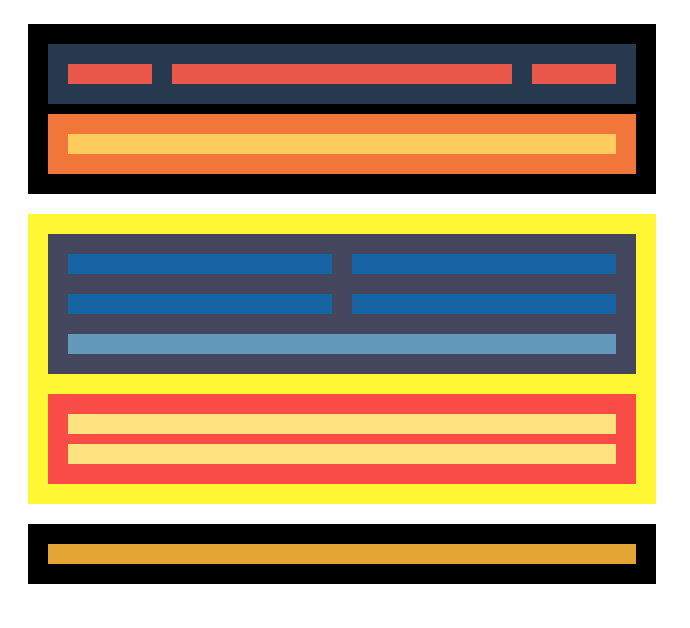

### Itinerario React online IT Academy
### Sprint 1 Maquetación I

### Nivel 1

#####   Ejercicio 1
A partir del wireframe que te aportamos en formato .png, tendrás que realizar la maquetación en formato escritorio. Es indiferente los colores escogidos, pero sí que es muy importante que hagas la estructura de cajas que te indicamos.

**Importante**

El ancho máximo de la capa que contendrá toda la maquetación será de 1200px (max-width:1200px).

#####  Ejercicio 2
Se debe empezar a preparar la adaptación a diferentes dispositivos, y por eso debes tener claro el concepto de Media Query. Observa que hay cambio de distribución y color de algunos elementos.

#####   Ejercicio 3
Como el caso anterior, ahora tendrás que realizar la adaptación a versión Mobile.

